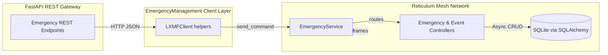
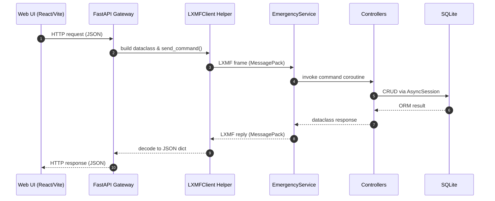

# Emergency Management Architecture Overview

## Context
The Emergency Management example layers LXMF messaging on top of SQLAlchemy-backed
persistence to expose CRUD semantics for emergency action messages and
associated event reports. The upcoming FastAPI gateway will reuse the existing
LXMF service stack while presenting a northbound REST API for web and mobile
clients.

### Runtime configuration

The LXMF service located at
`examples/EmergencyManagement/Server/server_emergency.py` accepts command-line
flags so operators can point the process at different Reticulum configurations,
LXMF storage directories, database locations, and authentication tokens without
editing the source code. The same CLI also controls the announced display name
and link keepalive interval. When the service starts it prints a summary of the
effective settings alongside the identity and destination hashes used by LXMF
clients and gateways.

## Domain Models and Persistence

Emergency data is expressed with dataclasses that subclass the shared
`BaseModel`, ensuring a consistent API for serialisation, validation, and ORM
bridging. `EmergencyActionMessage` mirrors the LXMF payload and provides
optional colour-coded status indicators via the `EAMStatus` enumeration.
`Detail` wraps nested emergency messages embedded within events, and `Point`
normalises positional data, coercing string or integer values into floats. Each
dataclass exposes `to_record`, `to_orm`, and `from_orm` helpers so controllers
can move between LXMF payloads, in-memory objects, and SQLAlchemy rows without
duplicating conversion logic. The ORM layer is backed by
`EmergencyActionMessageORM`, `EventORM`, and child tables for detail and point
records, enabling cascaded updates and deletes for nested objects.

To simplify persistence, `BaseModel` injects asynchronous CRUD helpers used by
the controllers. Class methods such as `Event.create` and `Event.update`
prepare nested `Detail` and `Point` payloads, attach them to the SQLAlchemy
session, and return fully-populated dataclasses once the transaction is
committed. The conversion helpers also accept raw dictionaries or JSON strings,
making it easy for LXMF handlers and REST gateways to accept loosely-typed
inputs while persisting normalised representations.

## Emergency Action Message Operations

| Operation | LXMF Command | Controller Method | Input Schema | Output |
| --- | --- | --- | --- | --- |
| Create | `CreateEmergencyActionMessage` | `EmergencyController.CreateEmergencyActionMessage` | `EmergencyActionMessage` dataclass | Echoes the created `EmergencyActionMessage`. |
| Retrieve | `RetrieveEmergencyActionMessage` | `EmergencyController.RetrieveEmergencyActionMessage` | Callsign (`str`) validated by JSON Schema | Matching `EmergencyActionMessage` or `None`. |
| Update | `PutEmergencyActionMessage` | `EmergencyController.PutEmergencyActionMessage` | `EmergencyActionMessage` dataclass | Updated `EmergencyActionMessage` or `None`. |
| Delete | `DeleteEmergencyActionMessage` | `EmergencyController.DeleteEmergencyActionMessage` | Callsign (`str`) validated by JSON Schema | Mapping with status `deleted` or `not_found` plus the callsign. |
| List | `ListEmergencyActionMessage` | `EmergencyController.ListEmergencyActionMessage` | – | Sequence of `EmergencyActionMessage` records. |

Every handler is decorated with `handle_exceptions`, which converts raised
errors into structured LXMF replies and keeps the service responsive even when
database operations fail. CRUD helpers inherited from `BaseModel` perform the
actual persistence work: `_create_instance`, `_retrieve_instance`,
`_update_instance`, `_delete_instance`, and `_list_instances` handle session
management so controllers stay focused on logging and input validation.

## Event Operations

| Operation | LXMF Command | Controller Method | Input Schema | Output |
| --- | --- | --- | --- | --- |
| Create | `CreateEvent` | `EventController.CreateEvent` | `Event` dataclass | Echoes the created `Event`. |
| Retrieve | `RetrieveEvent` | `EventController.RetrieveEvent` | Event UID validated as integer-or-numeric-string | `Event` or `None`. |
| Update | `PutEvent` | `EventController.PutEvent` | `Event` dataclass | Updated `Event` or `None`. |
| Delete | `DeleteEvent` | `EventController.DeleteEvent` | Event UID validated as integer-or-numeric-string | Mapping with status `deleted` or `not_found` plus the UID. |
| List | `ListEvent` | `EventController.ListEvent` | – | Sequence of `Event` records with nested `Detail` and `Point`. |

Event handlers lean on the richer lifecycle methods exposed by `Event`. The
dataclass accepts `Detail` and `Point` payloads in several formats (nested
objects, dictionaries, or JSON strings), normalises them, and persists related
ORM rows for `EventDetailORM` and `EventPointORM`. When retrieving rows,
`Event.from_orm` rehydrates nested dataclasses so the LXMF response contains a
fully structured event tree without manual serialization code in the
controllers.

## Validation and Schema Discovery

`EmergencyService` attaches JSON Schema validators to primitive commands such
as deletes and retrieves. Callsigns must be non-empty strings, and event
identifiers accept either integers or digit-only strings. During service start
up, `add_route` registers each command alongside the schema or dataclass used
for validation. Clients can call the built-in `GetSchema` command exposed by
`LXMFService` to discover these schemas and build dynamic forms or REST
contracts.

Because the service also registers link routes for every command, the same
validation rules apply whether requests arrive over traditional LXMF messages
or through live `RNS.Link` connections. Invalid payloads are rejected early and
the requester receives a structured error message produced by the controller
decorators.

## Command Registration and Flow

`EmergencyService` registers each LXMF command string with the corresponding
controller coroutine and optional dataclass schema. When the LXMF runtime
receives a command, it deserializes the payload to the declared dataclass before
invoking the controller, and the handler responses are serialized back to
MessagePack for transport.



## Northbound REST API Strategy

The REST gateway will translate HTTP calls into LXMF commands using the
`reticulum_openapi.client.LXMFClient` implementation. The existing client helper
functions already wrap `send_command` for create and retrieve operations; the
same pattern can be extended for update, delete, and list requests. By keeping
REST handlers thin, the FastAPI layer can reuse dataclass validation, MessagePack
serialization, and error handling already implemented in the LXMF controllers.

Key aspects of the northbound design:

- **Schema Reuse:** FastAPI request and response models can be generated from
  the existing `EmergencyActionMessage`, `Event`, `Detail`, and `Point`
  dataclasses to maintain parity with LXMF payloads.
- **Command Mapping:** REST routes should map 1:1 with the LXMF command names
  registered in `EmergencyService`, ensuring predictable command dispatch.
- **Session Independence:** The REST layer remains stateless, delegating all
  state changes to the LXMF controllers via the mesh network connection.

## Reusable Modules for the FastAPI Layer

- `examples.EmergencyManagement.Server.models_emergency` provides the dataclasses
  and enumerations that double as serialization contracts and database DTOs.
- `examples.EmergencyManagement.Server.controllers_emergency` exposes the async
  CRUD handlers that are already orchestrated around database sessions and error
  translation utilities.
- `examples.EmergencyManagement.Server.service_emergency` declares the LXMF
  command routing table that the REST layer should mirror.
- `examples.EmergencyManagement.client.client` supplies the `LXMFClient` alias
  and helper functions for sending commands and decoding responses; these can be
  invoked directly from FastAPI endpoints to avoid duplicating transport logic.
- `reticulum_openapi.model.BaseModel` centralizes persistence helpers, meaning
  any new dataclasses introduced for REST endpoints can follow the same pattern
  for storage and retrieval.

Together, these components define the full command lifecycle from REST request
through LXMF transport to asynchronous database persistence.

## UI and API Interaction

The sequence diagram below illustrates how a single web request travels from the browser through the FastAPI gateway and into the LXMF service before returning a response.



## Deployment Topology

This deployment view highlights the three tiers involved during development: the browser-based SPA, the FastAPI edge layer, and the Reticulum mesh components.

```mermaid
graph TB
    subgraph Browser
        SPA[Emergency Management SPA]
    end
    subgraph EdgeGateway[FastAPI Tier]
        GatewayApp[web_gateway.app]
        NorthAPI[north_api.app (health/config)]
    end
    subgraph Mesh[Reticulum Mesh Network]
        LXMFClient[Shared LXMFClient]
        EmergencyService[EmergencyService]
        SQLite[(SQLite DB)]
    end

    SPA -- REST --> GatewayApp
    SPA -- Health --> NorthAPI
    GatewayApp -- LXMF commands --> LXMFClient
    LXMFClient -- Mesh frames --> EmergencyService
    EmergencyService -- Async CRUD --> SQLite
    EmergencyService -- SSE/Event bridge --> GatewayApp
    GatewayApp -- Live updates --> SPA
```
