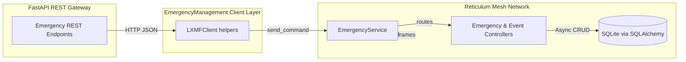

# Emergency Management Architecture Overview

## Context
The Emergency Management example layers LXMF messaging on top of SQLAlchemy-backed
persistence to expose CRUD semantics for emergency action messages and
associated event reports. The upcoming FastAPI gateway will reuse the existing
LXMF service stack while presenting a northbound REST API for web and mobile
clients.

## Emergency Action Message Operations

| Operation | LXMF Command | Controller Method | Input Dataclass | Output |
| --- | --- | --- | --- | --- |
| Create | `CreateEmergencyActionMessage` | `EmergencyController.CreateEmergencyActionMessage` | `EmergencyActionMessage` | Echoes the created `EmergencyActionMessage` instance. |
| Retrieve | `RetrieveEmergencyActionMessage` | `EmergencyController.RetrieveEmergencyActionMessage` | Callsign (`str`) | `EmergencyActionMessage` or `None` if not found. |
| Update | `PutEmergencyActionMessage` | `EmergencyController.PutEmergencyActionMessage` | `EmergencyActionMessage` | Updated `EmergencyActionMessage` or `None`. |
| Delete | `DeleteEmergencyActionMessage` | `EmergencyController.DeleteEmergencyActionMessage` | Callsign (`str`) | Status mapping with `deleted`/`not_found`. |
| List | `ListEmergencyActionMessage` | `EmergencyController.ListEmergencyActionMessage` | – | Sequence of `EmergencyActionMessage` records. |

All handlers delegate to the shared `BaseModel` persistence helpers. The
`EmergencyActionMessage` dataclass defines optional status fields enumerated by
`EAMStatus` and ties into the SQLAlchemy ORM model through `__orm_model__`. The
controller uses `dataclasses.asdict` to pass dataclass payloads into the
`create` and `update` helpers, which in turn provide `create`, `get`, `list`,
`update`, and `delete` primitives against the `AsyncSession`.

## Event Operations

| Operation | LXMF Command | Controller Method | Input Dataclass | Output |
| --- | --- | --- | --- | --- |
| Create | `CreateEvent` | `EventController.CreateEvent` | `Event` | Echoes the created `Event` instance. |
| Retrieve | `RetrieveEvent` | `EventController.RetrieveEvent` | Event UID (`str`) | `Event` or `None` if not found. |
| Update | `PutEvent` | `EventController.PutEvent` | `Event` | Updated `Event` or `None`. |
| Delete | `DeleteEvent` | `EventController.DeleteEvent` | Event UID (`str`) | Status mapping with `deleted`/`not_found`. |
| List | `ListEvent` | `EventController.ListEvent` | – | Sequence of `Event` records. |

The `Event` dataclass embeds nested `Detail` and `Point` dataclasses, allowing
LXMF payloads to carry nested objects. As with emergency messages, CRUD
operations ultimately invoke the `BaseModel` convenience methods to manage ORM
instances and convert database rows back into dataclasses.

## Command Registration and Flow

`EmergencyService` registers each LXMF command string with the corresponding
controller coroutine and optional dataclass schema. When the LXMF runtime
receives a command, it deserializes the payload to the declared dataclass before
invoking the controller, and the handler responses are serialized back to
MessagePack for transport.

## Northbound REST API Strategy

The REST gateway will translate HTTP calls into LXMF commands using the
`reticulum_openapi.client.LXMFClient` implementation. The existing client helper
functions already wrap `send_command` for create and retrieve operations; the
same pattern can be extended for update, delete, and list requests. By keeping
REST handlers thin, the FastAPI layer can reuse dataclass validation, MessagePack
serialization, and error handling already implemented in the LXMF controllers.

Key aspects of the northbound design:

- **Schema Reuse:** FastAPI request and response models can be generated from
  the existing `EmergencyActionMessage`, `Event`, `Detail`, and `Point`
  dataclasses to maintain parity with LXMF payloads.
- **Command Mapping:** REST routes should map 1:1 with the LXMF command names
  registered in `EmergencyService`, ensuring predictable command dispatch.
- **Session Independence:** The REST layer remains stateless, delegating all
  state changes to the LXMF controllers via the mesh network connection.

## Reusable Modules for the FastAPI Layer

- `examples.EmergencyManagement.Server.models_emergency` provides the dataclasses
  and enumerations that double as serialization contracts and database DTOs.
- `examples.EmergencyManagement.Server.controllers_emergency` exposes the async
  CRUD handlers that are already orchestrated around database sessions and error
  translation utilities.
- `examples.EmergencyManagement.Server.service_emergency` declares the LXMF
  command routing table that the REST layer should mirror.
- `examples.EmergencyManagement.client.client` supplies the `LXMFClient` alias
  and helper functions for sending commands and decoding responses; these can be
  invoked directly from FastAPI endpoints to avoid duplicating transport logic.
- `reticulum_openapi.model.BaseModel` centralizes persistence helpers, meaning
  any new dataclasses introduced for REST endpoints can follow the same pattern
  for storage and retrieval.

Together, these components define the full command lifecycle from REST request
through LXMF transport to asynchronous database persistence.
