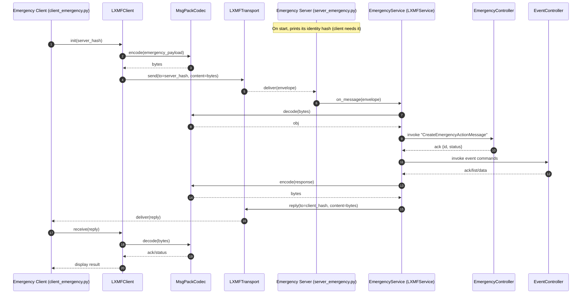

# Emergency Management Example

The Emergency Management example demonstrates how to combine a Reticulum LXMF service, a shared northbound client, a FastAPI gateway, and a Vite-powered React UI that all speak the same OpenAPI contract.


The stack models two resources:

- **EmergencyActionMessage** – status reports scoped to a `callsign`.
- **Event** – event envelopes keyed by a `uid`.

Both dataclasses treat their identifying field (`callsign` or `uid`) as required; every other property may be omitted or `null` in the JSON payload. The complete contract lives in [`API/EmergencyActionMessageManagement-OAS.yaml`](API/EmergencyActionMessageManagement-OAS.yaml).

## LXMF command catalogue

The mesh service exposes symmetrical LXMF commands that are consumed by the CLI, FastAPI gateway, and web UI. Message and event
workflows share consistent CRUD verb names:

| Resource | Create | Update | Retrieve | List | Delete |
| --- | --- | --- | --- | --- | --- |
| Emergency action message | `CreateEmergencyActionMessage` | `PutEmergencyActionMessage` | `RetrieveEmergencyActionMessage` | `ListEmergencyActionMessage` | `DeleteEmergencyActionMessage` |
| Event | `CreateEvent` | `PutEvent` | `RetrieveEvent` | `ListEvent` | `DeleteEvent` |

The gateway also relays server-sent notifications via `/notifications/stream` so web clients can subscribe to live updates.

## Repository layout

| Folder | Description |
| --- | --- |
| `API/` | OpenAPI specification that drives the example. |
| `Server/` | LXMF service, controllers, dataclasses, and a SQLite persistence layer. |
| `client/` | Shared LXMF client helper, CLI demo, and optional northbound FastAPI utilities. |
| `web_gateway/` | FastAPI gateway that exposes REST endpoints backed by the LXMF service. |
| `webui/` | Vite + React + TypeScript single-page application that consumes the gateway. |

## Prerequisites

- Python 3.11+
- Node.js 18+ and npm
- Reticulum installed and configured so both the server and client can join the mesh

## Install dependencies

From the repository root:

```bash
pip install -r requirements.txt
```

Install the web UI toolchain once:

```bash
cd examples/EmergencyManagement/webui
npm install
```

## Configuration

### LXMF client defaults

Both the CLI demo and the FastAPI gateway read [`client/client_config.json`](client/client_config.json). Update or create the file with settings that match your mesh:

```json
{
  "server_identity_hash": "<destination hash>",
  "client_display_name": "Emergency Client",
  "request_timeout_seconds": 30,
  "lxmf_config_path": null,
  "lxmf_storage_path": null,
  "shared_instance_rpc_key": "<hex rpc key>",
  "generate_test_messages": false,
  "enable_interactive_menu": true,
  "test_message_count": 5,
  "test_event_count": 5
}
```

- Override the location of the configuration file with `NORTH_API_CONFIG_PATH` or provide JSON directly through `NORTH_API_CONFIG_JSON`.
- Requests can target different LXMF services by supplying an `X-Server-Identity` header or a `server_identity` query parameter to the gateway.
- The repository ships with a sample Reticulum directory at [`examples/EmergencyManagement/.reticulum`](./.reticulum) that pins `rpc_key` to `F1E2D3C4B5A697887766554433221100`. When the gateway and LXMF service use this directory (or any config with the same key) they can attach to the same shared instance without prompting.

| Key | Purpose |
| --- | --- |
| `server_identity_hash` | Destination LXMF identity hash for the Emergency service. |
| `client_display_name` | Friendly name announced by the LXMF client. |
| `request_timeout_seconds` | Timeout applied to each LXMF command issued by the client or gateway. |
| `lxmf_config_path` | Optional override for the Reticulum configuration directory. |
| `lxmf_storage_path` | Optional override for the LXMF storage directory. |
| `shared_instance_rpc_key` | RPC key used when attaching to a shared Reticulum instance. |
| `generate_test_messages` | When `true`, the CLI seeds random emergency messages and events during startup. |
| `enable_interactive_menu` | Enables the interactive CLI menu after the initial demo run. Disable when scripting automated flows. |
| `test_message_count` | Number of emergency messages to seed when `generate_test_messages` is enabled. |
| `test_event_count` | Number of events to seed when `generate_test_messages` is enabled. |

### Managing the link destination from the gateway

The gateway now exposes a small management API so you can edit the default link destination without touching `client_config.json` manually:

| Method | Endpoint | Purpose |
| --- | --- | --- |
| `GET` | `/link-destination` | Inspect the stored `server_identity_hash`, config source path, and live link status. |
| `POST` | `/link-destination` | Create the default link destination when none exists. |
| `PUT` | `/link-destination` | Update the stored link destination hash. |
| `DELETE` | `/link-destination` | Clear the configured link destination. |

When the configuration was loaded from a writable JSON file (the default `client/client_config.json` or a path supplied via `NORTH_API_CONFIG_PATH`), the Dashboard page in the React UI surfaces a form that drives these endpoints. Saving a new value persists it to disk and automatically restarts the LXMF link loop so the gateway reconnects to the updated server identity. If the gateway loaded its configuration exclusively from environment variables (for example via `NORTH_API_CONFIG_JSON`), the form is disabled and the API returns `503` to signal that runtime edits are not allowed.

### Service runtime configuration

[`Server/server_emergency.py`](Server/server_emergency.py) now accepts runtime overrides so you can adapt the deployment to your
mesh topology without editing source code. Invoke `python server_emergency.py --help` to review the CLI. Commonly used flags
include:

| Flag | Purpose |
| --- | --- |
| `--config-path PATH` | Override the Reticulum configuration directory used to initialise the LXMF stack. |
| `--storage-path PATH` | Choose a custom LXMF storage directory for message queues and identity caches. |
| `--display-name NAME` | Change the service's announced LXMF display name. |
| `--auth-token TOKEN` | Require clients to present a matching auth token with every command. |
| `--link-keepalive-interval SECONDS` | Adjust the interval between LXMF link keepalive packets. |
| `--database-path PATH` / `--database PATH` | Point the SQLite database at a specific filesystem location. |
| `--database-url URL` | Supply a full SQLAlchemy URL (for example, PostgreSQL or `sqlite+aiosqlite`). |

When no CLI argument is provided, the helper honours the `EMERGENCY_DATABASE_URL` environment variable before falling back to the
default SQLite file that ships with the example. The CLI prints the resolved hashes, Reticulum directories, and database
connection string so you can verify the active configuration at startup.

### Web UI environment

Copy [`webui/.env.example`](webui/.env.example) to `webui/.env` and set:

| Variable | Purpose |
| --- | --- |
| `VITE_API_BASE_URL` | Base URL of the FastAPI gateway. |
| `VITE_UPDATES_URL` | Optional SSE endpoint (defaults to `<base>/notifications/stream`). |
| `VITE_SERVER_IDENTITY` | Optional LXMF destination hash forwarded as `X-Server-Identity`. |

## Running the stack

1. **Start the LXMF service**

   ```bash
   cd examples/EmergencyManagement/Server
   python server_emergency.py \
       --config-path /path/to/.reticulum \
       --storage-path /path/to/storage \
       --display-name "Emergency LXMF Service"
   ```

   The service prints its identity hash on startup. Record it in `client_config.json`. Stop it with `Ctrl+C` when finished.

2. **(Optional) Run the CLI demo**

   ```bash
   cd examples/EmergencyManagement
   python client/client_emergency.py
   ```

   The client reuses the stored identity hash (or prompts for one) and exposes an interactive menu for creating, listing, updating, retrieving, and deleting emergency action messages over LXMF.

3. **Expose the REST gateway**

   In a new terminal session:

   ```bash
   uvicorn examples.EmergencyManagement.web_gateway.app:app --host 0.0.0.0 --port 8000 --reload
   ```

   - Set `EMERGENCY_GATEWAY_ALLOWED_ORIGINS` to a comma-separated list to restrict CORS.
   - Provide the LXMF client configuration via `NORTH_API_CONFIG_PATH` or inline JSON with `NORTH_API_CONFIG_JSON` when the
     defaults do not match your deployment.
   - The gateway loads the shared LXMF client during startup, announces its identity, and retries the LXMF link until the
     server accepts the connection. Watch the logs for interface status, link state changes, and the version banner.

4. **Launch the React UI**

   ```bash
   cd examples/EmergencyManagement/webui
   VITE_API_BASE_URL=http://localhost:8000 npm run dev
   ```

   The development server listens on <http://localhost:5173>. The UI consumes the REST gateway and subscribes to the optional live update stream.

5. **Optional health API**

   Run the lightweight health and configuration API alongside the gateway if desired:

   ```bash
   uvicorn examples.EmergencyManagement.client.north_api.app:app --host 0.0.0.0 --port 8100
   ```

## Building and compiling

- **Server and gateway** – both are pure Python applications; no compilation step is required beyond installing dependencies.
- **Web UI** – compile the production bundle with:

  ```bash
  cd examples/EmergencyManagement/webui
  npm run build
  ```

  Preview the output locally using `npm run preview`.

## Component interaction



With all components running, the SPA issues REST commands to the gateway, which converts JSON payloads into dataclasses, dispatches LXMF commands through the shared client, and translates MessagePack responses back into JSON for the browser.
