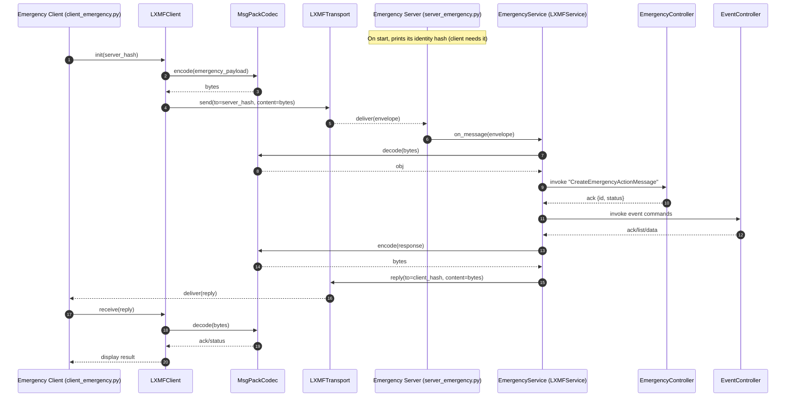

# Emergency Management Example

The Emergency Management example demonstrates how to combine a Reticulum LXMF service, a shared northbound client, a FastAPI gateway, and a Vite-powered React UI that all speak the same OpenAPI contract. The stack models two resources:

- **EmergencyActionMessage** – status reports scoped to a `callsign`.
- **Event** – event envelopes keyed by a `uid`.

Both dataclasses treat their identifying field (`callsign` or `uid`) as required; every other property may be omitted or `null` in the JSON payload. The complete contract lives in [`API/EmergencyActionMessageManagement-OAS.yaml`](API/EmergencyActionMessageManagement-OAS.yaml).

## Repository layout

| Folder | Description |
| --- | --- |
| `API/` | OpenAPI specification that drives the example. |
| `Server/` | LXMF service, controllers, dataclasses, and a SQLite persistence layer. |
| `client/` | Shared LXMF client helper, CLI demo, and optional northbound FastAPI utilities. |
| `web_gateway/` | FastAPI gateway that exposes REST endpoints backed by the LXMF service. |
| `webui/` | Vite + React + TypeScript single-page application that consumes the gateway. |

## Prerequisites

- Python 3.11+
- Node.js 18+ and npm
- Reticulum installed and configured so both the server and client can join the mesh

## Install dependencies

From the repository root:

```bash
pip install -r requirements.txt
```

Install the web UI toolchain once:

```bash
cd examples/EmergencyManagement/webui
npm install
```

## Configuration

### LXMF client defaults

Both the CLI demo and the FastAPI gateway read [`client/client_config.json`](client/client_config.json). Update or create the file with settings that match your mesh:

```json
{
  "server_identity_hash": "<destination hash>",
  "client_display_name": "Emergency Client",
  "request_timeout_seconds": 30,
  "lxmf_config_path": null,
  "lxmf_storage_path": null
}
```

- Override the location of the configuration file with `NORTH_API_CONFIG_PATH` or provide JSON directly through `NORTH_API_CONFIG_JSON`.
- Requests can target different LXMF services by supplying an `X-Server-Identity` header or a `server_identity` query parameter to the gateway.

### Web UI environment

Copy [`webui/.env.example`](webui/.env.example) to `webui/.env` and set:

| Variable | Purpose |
| --- | --- |
| `VITE_API_BASE_URL` | Base URL of the FastAPI gateway. |
| `VITE_UPDATES_URL` | Optional SSE endpoint (defaults to `<base>/notifications/stream`). |
| `VITE_SERVER_IDENTITY` | Optional LXMF destination hash forwarded as `X-Server-Identity`. |

## Running the stack

1. **Start the LXMF service**

   ```bash
   cd examples/EmergencyManagement/Server
   python server_emergency.py
   ```

   The service prints its identity hash on startup. Record it in `client_config.json`. Stop it with `Ctrl+C` when finished.

2. **(Optional) Run the CLI demo**

   ```bash
   cd examples/EmergencyManagement
   python client/client_emergency.py
   ```

   The client reuses the stored identity hash (or prompts for one), sends a `CreateEmergencyActionMessage` command, and then retrieves the stored record to verify persistence in `emergency.db`.

3. **Expose the REST gateway**

   In a new terminal session:

   ```bash
   uvicorn examples.EmergencyManagement.web_gateway.app:app --host 0.0.0.0 --port 8000 --reload
   ```

   - Set `EMERGENCY_GATEWAY_ALLOWED_ORIGINS` to a comma-separated list to restrict CORS.
   - The gateway loads the shared LXMF client during startup and keeps it alive until shutdown.

4. **Launch the React UI**

   ```bash
   cd examples/EmergencyManagement/webui
   VITE_API_BASE_URL=http://localhost:8000 npm run dev
   ```

   The development server listens on <http://localhost:5173>. The UI consumes the REST gateway and subscribes to the optional live update stream.

5. **Optional health API**

   Run the lightweight health and configuration API alongside the gateway if desired:

   ```bash
   uvicorn examples.EmergencyManagement.client.north_api.app:app --host 0.0.0.0 --port 8100
   ```

## Building and compiling

- **Server and gateway** – both are pure Python applications; no compilation step is required beyond installing dependencies.
- **Web UI** – compile the production bundle with:

  ```bash
  cd examples/EmergencyManagement/webui
  npm run build
  ```

  Preview the output locally using `npm run preview`.

## Component interaction



With all components running, the SPA issues REST commands to the gateway, which converts JSON payloads into dataclasses, dispatches LXMF commands through the shared client, and translates MessagePack responses back into JSON for the browser.
